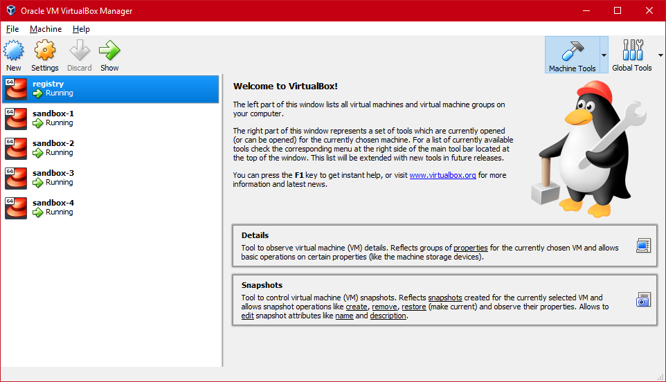

# Install Kubernetes by Ansible

Recommend five machines to install Kubernetes.

- One DNS and Docker Registry
- Four Kubernetes nodes
- One node as master node

Edit [production.ini](./production.ini) and [all.yaml](./group_vars/all.yaml)

## Prepare Virtualbox and Vagrant (Microsoft Windows 10 Pro)

Install [Chocolatey](https://chocolatey.org/install) with PowerShell.exe.

```powershell
Set-ExecutionPolicy Bypass -Scope Process -Force; iex ((New-Object System.Net.WebClient).DownloadString('https://chocolatey.org/install.ps1'))
```

Then, install [Oracle VM VirtualBox](https://chocolatey.org/packages/virtualbox)and [Vagrant by HashiCorp](https://chocolatey.org/packages/vagrant)

```powershell
choco install virtualbox
choco install vagrant
```

Reboot your Windows.

Launch virtual machines.

```bash
vagrant box add centos/7 --provider=virtualbox
vagrant up
```



It's gonna take a long time to boot these virtual machines, recommended to do this in the SSD disk.

## Install Kubernetes

**Install DNS and pull images - WIP**

```bash
make prepare
```

It will set up Ansible, Docker Registry and PowerDNS with MariaDB 10.

**Test connection**

```bash
make test
```

**Install**

```bash
make install
```

**Reset**

```bash
make reset
```

## Access web console

Create a CNAME as traefik.cluster.local and point to storage-2.cluster.local

Access http://traefik.cluster.local/dashboard/

## License

MIT